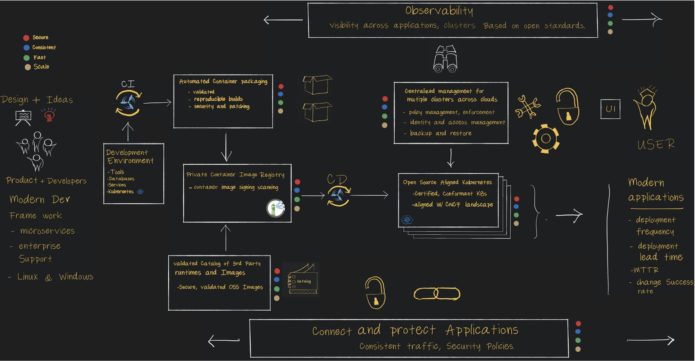

# Tanzu Governance and Compliance Demo Environment

Provides a lab environment for demonstrating governance and compliance
for a Java application deployed to the VMware Tanzu Platform. The lab
builds upon the great work my colleauges have done on [TKG Lab]
(https://github.com/Tanzu-Solutions-Engineering/tkg-lab) and on creating 
an [end-to-end demonstration of the developer and operator experience]
(https://github.com/doddatpivotal/tkg-lab-e2e-adaptation) showcasing Tanzu.

The Lab uses the [Spring Pet Clinic](https://github.com/spring-projects/spring-petclinic)
application as the codebase for the demonstration. 

## Why Use This Lab

This lab is designed to explore and demonstrate the governance points in
the Tanzu portfolio. It incorporates some additional capabilities, like
static and dynamic application scanning, to highlight the full context in 
which the Tanzu capabilities operate and establish a real-life layering of 
controls.

The high-level architecture of the Tanzu portfolio and its capabilities is
shown in the Tanzu Overview Whiteboard

many Tanzu components provide automated governance controls that increase
security, consistency, and resiliency to the process you use to build, run,
and manage software workloads.

### Controls in the CI/CD Pipeline

VMware's open source [Concourse](https://concourse-ci.org) orchestrates the
CI/CD pipeline that builds, validates, and deploys the application. The 
pipeline uses [Tanzu Build Service](https://tanzu.vmware.com/build-service)
and it's [cloud-native buildpacks](https://buildpacks.io) to assure the 
container is build with a trusted version of the JDK and the underlying
operating system.

The pipeline uses additional open source tools to assure that both the 
application and the Kubernetes objects that deploy it are secure. 
[Sonarqube](https://sonarqube.com) scans the Java code before it passing 
the JAR file to [TBS](https://tanzu.vmware.com/build-service) to 
containerize. Before deploying the container, [Conftest](https://conftest.dev)
checks the Kubernetes manifests to assure they are compliant with the
workload [polices](conftest/policy) we'll later enforce at runtime.

After building the images and confirming tha the Kubernetes manifests
pass muster, the pipeline does a staging deployment and runs the open 
source [OWASP ZAP](https://owasp.org/www-project-zap/) to do a quick scan 
of the running application. This is not a deep penetration test but gives
a quick analysis of whether the application is safe as deployed.

Lastly, the code is deployed to [TKG](https://tanzu.vmware.com/kubernetes-grid).
The pipeline ends there, but other controls are at play both as part
of the deployment and as part of the ongoing management of the workload.

### Workload Control Points

To assure that our running workloads are compliant and secure, we use
the open source [Harbor registry](https://goharbor.io) (sponsored
primarily by VMware) together with [Tanzu Mission Control](https://tanzu.vmware.com/mission-control).

[Harbor](https://goharbor.io) scans our workloads to help us to 
understand the CVEs that are present in each container workload. It
also prevents workloads with CVEs above a certain level from 
executing. Workloads are cleared by [Harbor](https://goharbor.io)
are subject to additional policy enforced by [TMC](https://tanzu.vmware.com/mission-control).

[TMC](https://tanzu.vmware.com/mission-control) ensures that our
workload namespaces only allow workloads pulled from the [Harbor 
registry](https://goharbor.io) to run. It also validates the 
deployment and ingress objects against [policies](tmc/policy/template)
that assure that a minimum number of replicas run and that HTTPS
is used to access the code.

## Standing Up the Lab

See the [step by step instructions](docs/instructions.md) on how to configure
the lab.
